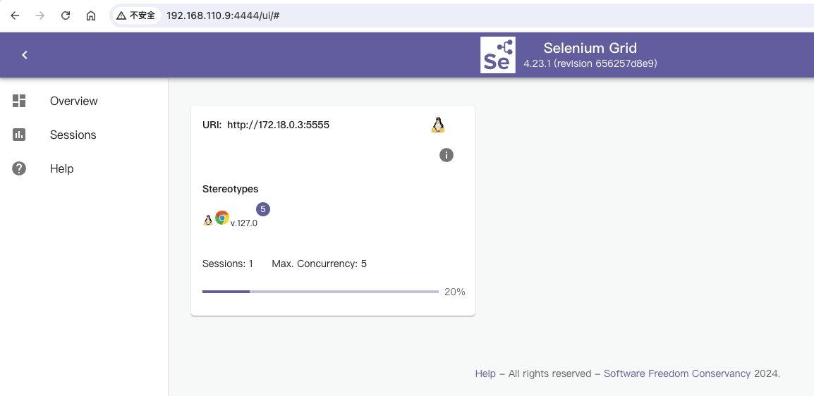
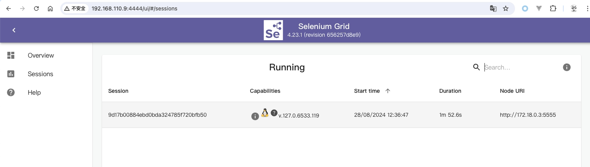

# chrome-plugin-test

## Selenium
Selenium Grid 是 Selenium 的三大组件之一，它可以在多台机器上并行运行测试，集中管理不同的浏览器版本和浏览器配置。

### docker compose 启动selenium grid集群：

```commandline
version: '2'
services:
  chrome:
    image: selenium/node-chromium:127.0-chromedriver-127.0-grid-4.23.1-20240820
    shm_size: 2gb
    depends_on:
      - selenium-hub
    environment:
      - SE_EVENT_BUS_HOST=selenium-hub
      - SE_EVENT_BUS_PUBLISH_PORT=4442
      - SE_EVENT_BUS_SUBSCRIBE_PORT=4443
      - SE_NODE_OVERRIDE_MAX_SESSIONS=true
      - SE_NODE_MAX_SESSIONS=5
      - SE_START_XVFB=false
      - SE_ENABLE_BROWSER_LEFTOVERS_CLEANUP=true
    ports:
      - "6900:5900"

  selenium-hub:
    image: selenium/hub:4.23.1-20240820
    ports:
      - "4442:4442"
      - "4443:4443"
      - "4444:4444"
```

当前测试环境：

单机上开启一个hub和一个node，node为chorme环境，通过远程代码调用hub，管理chrome实例的创建、关闭

> 注意：node的配置项 SE_NODE_MAX_SESSIONS 建议根据宿主机资源情况配置，即系统一般有几个core，配置Max_Sessions为几，该参数表示node上最多能开启几个chrome实例

更多参数配置细节参考：
https://github.com/SeleniumHQ/docker-selenium






### python库调用

```commandline
from selenium import webdriver

user_data_dirs = "/tmp/u1"
chrome_options = webdriver.ChromeOptions()
chrome_options.add_argument(f'--user-data-dir={user_data_dirs}')
chrome_options.add_argument("--headless")
chrome_options.add_argument("--disable-gpu")

driver = webdriver.Remote(command_executor='http://localhost:4444',options=chrome_options)

```

上述为简单的测试demo，通过远程调用selenium hub的api，创建一个chrome实例，用户操作数据存储在/tmp/u1目录

> 注意： chrome加载插件暂未测试记录，需要另外调研测试

参考上述demo，管理服务api设计：

- 一个server web 后端服务，选择一个框架实现，比如flask
- 实现若干api接口：创建chrome实例、关闭chrome实例，查询chrome实例列表等等（具体接口见需求文档）
- 每次开启一个chrome实例都返回一个session ID，可以考虑是否用来作为用户ID（需考虑使用同一个user_data_dirs启动的实例，sessionID是否不变）
- 每个chrome实例都可以配置一个user_data_dirs，可以保证用户数据隔离

